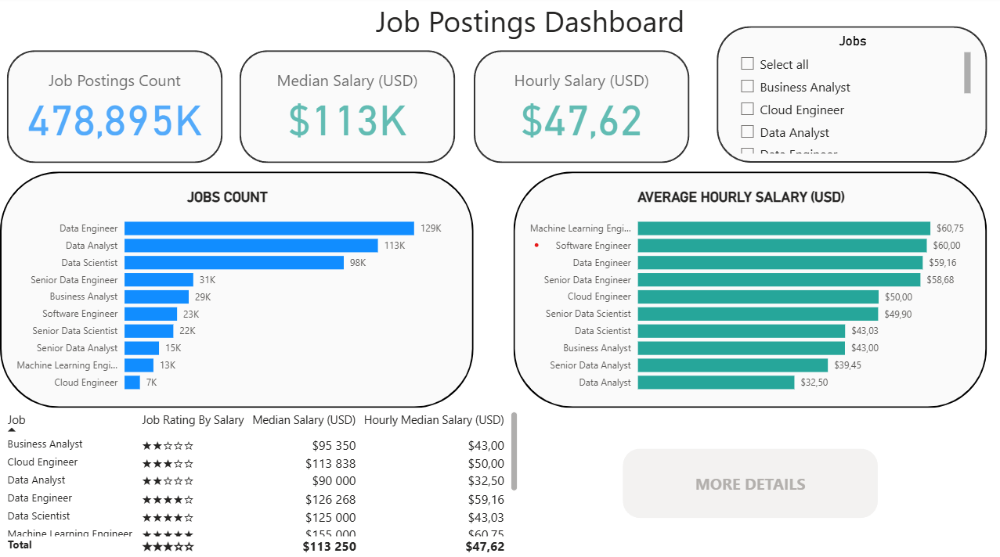
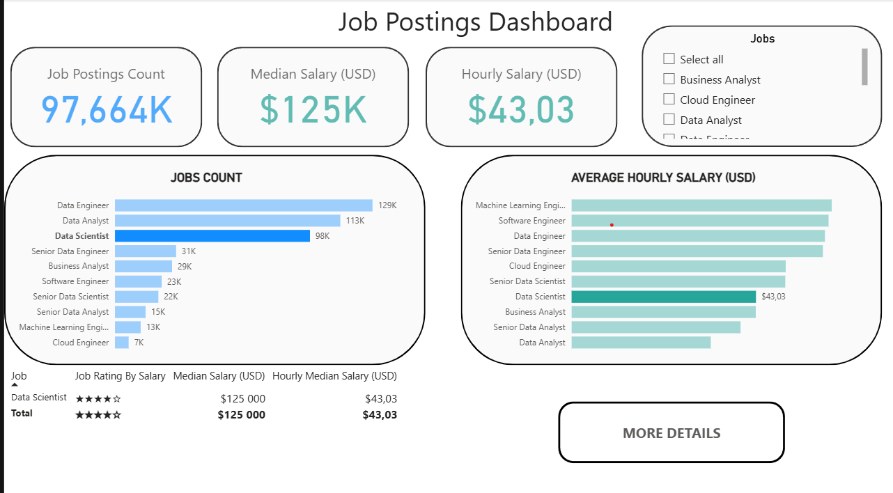
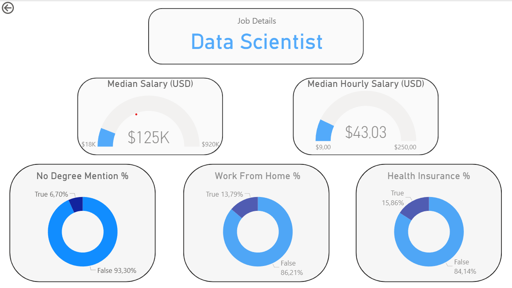

# 💼 Jobs Dashboard – Power BI

## 📘 Bevezetés
A projektem célja egy **Power BI alapú, letisztult és könnyen értelmezhető dashboard** létrehozása, amely az **álláshirdetések adatait** elemzi különböző szempontok alapján.

A hangsúly a **minimalista megjelenésen**, a **strukturált adatmegjelenítésen** és a **drill-through funkción** volt, hogy az elemzés egyszerre legyen esztétikus és funkcionális.

---
## Dashboard - Főképernyő

---

---

## Dashboard - Drill Through

---

## 🧠 Készségek, amelyeket a projekt során elsajátítottam
- 🔹 **Power BI Dashboard design** – vizuális struktúra és elrendezés megtervezése shape-ekkel  
- 🔹 **Power Query** – adattisztítás, típuskonverzió és adat-előkészítés  
- 🔹 **DAX alapok** – számított mértékek és KPI-ok létrehozása  
- 🔹 **Drill-through oldalak** – interaktív, többnézetes riport felépítése  
- 🔹 **Adatvizualizációs szemlélet** – hogyan lehet kevés vizuállal is informatív riportot készíteni  
- 🔹 **Adatmodellezés és típuskezelés** – pontos adattípusok beállítása (szám, dátum, szöveg, pénz)

---

## 🏁 Konklúzió
Ez a projekt egy **komplex, de letisztult Power BI riport**, amely bemutatja a munkaerőpiaci hirdetések mintáit és trendjeit.  
A fejlesztés során megtanultam, hogyan lehet az adatokat vizuálisan úgy ábrázolni, hogy azok **egyszerre informatívak és esztétikusak** legyenek.